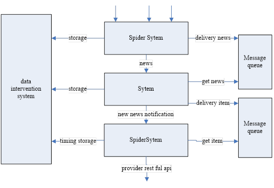

# NBA-TALL Project

## [中文版](/README_ZH.md)

## Background

Because we are in the age of information, All kinds of news portals has their own news 
classification platform. But people's energy and time are always limited. The complexity of 
news and information has affected people's reading experience greatly. How to integrate the 
classified news content of various news websites has become an urgent problem to be solved . 
Since the initiators of the project prefer to pay attention to NBA news, we select the NBA 
news in the sports news of the big portal platforms as the integration target and name it 
nba-tall.

## Introduction

The nba-tall project uses the scrapy crawler framework to crawl the NBA classified news of 
various news portals dynamically, then uses the interface "short text similarity"  provided 
by the Baidu AI open platform to calculate the similarity of the two news headlines, and 
classifies them according to the threshold. Finally, extract the news content after the 
classification, and attach the URL link of the classified content to users uniformity.

## Structure

***

The structure of the project is shown as follows:：

## Detailed introduction to the subsystem 
***
**（1）Spider system SS： **

The Spider system is the most basic part of the project. We get data from a given source  regularly, get new news and delivery them to the (message queue)A, and store some important information of the news. We use the Scrapy crawler framework of Python language environment for news crawling. Of course, you can also use requests library +bs4 library +re to crawl. However, using the Scrapy crawler framework can  meet our needs in commen. In this simple case,Scrapy has a unique advantage compared to the latter method, such as simple, easy to learn, and so on.

**（2）Clustering system DFS： **

The cluster system maintains a  table named item, the DF system gets the news from the message queue A to the news (or the message queue is pushed to the DF system). For the obtained news, traverse the item table and call the "short text similarity" interface to find out which item belongs to the news, and then call the interface to store the information. If it is not found, it is a new item, then an additional item is added to the item table, and the item is delivered to the message queue B.

**（3）Timeline System TS： **

The function of  Timeline System is updating news content dynamically. For example, today's 
headline APP, every time the drop-down refresh,it will give you the latest news. Like some 
news portals, every time a page is refreshed, new content is pushed. We crawl the news 
content regularly and store it, then the user does a refresh operation, the system will will 
push the content after the update.

**（4）Data Intervention System DIS： **

The purpose of data intervention system is to separate data warehousing from specific systems. The database provides access to the database data table, then DI system operates the underlying database directly and provides restful interface to the external.

## How to Contribute

1.  Every member of the ACLoong community can fork this repository to your Github;

2. Use this command(`git clone` + `your repository url`) to clone this repository from your Github 
to local；

3. The Team members compete the part that you are interested in, place the code under the 
corresponding folder,then use this command (`git add`,` git commit -m` + "commmit message") to 
submit the changes to the local repository after the achievement of your changes；

4. Use the (`git push`) command to synchronize local modifications to Github's remote repository；

5.Send (`pull requests`) and everyone of our team can review it ；

6.(`review`)adopt or return to have a modification。

## Thanks

Thanks for all those who have contributed to it.
